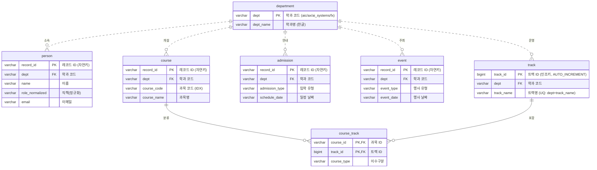
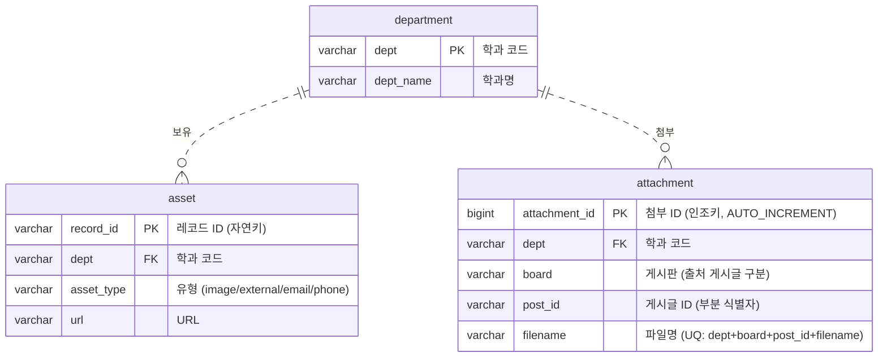
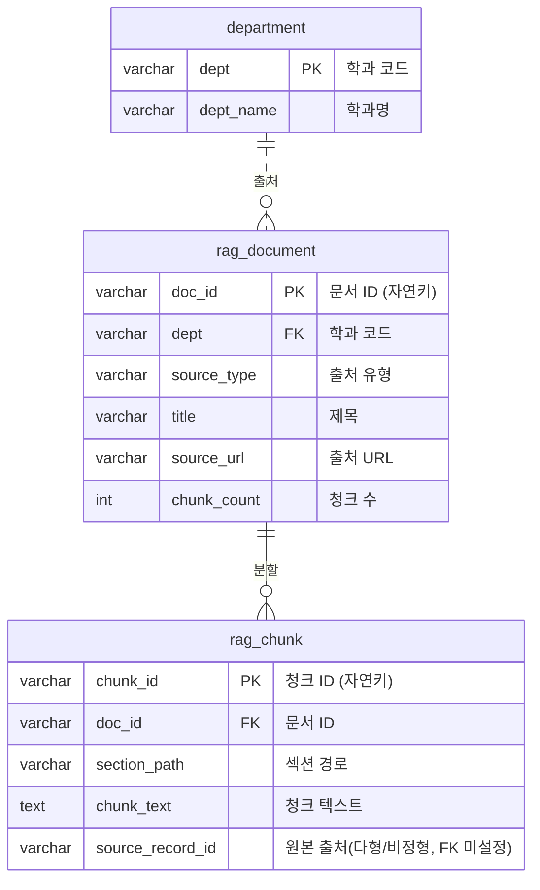

# KAIST AI대학 데이터 — ERD (개체-관계 다이어그램)

> 미리보기: VS Code에서 이 파일을 열고 `Ctrl+Shift+V` (Markdown Preview).
> Mermaid 미리보기 확장이 있으면 다이어그램이 그림으로 보입니다.

이 모델은 **3개 주제 영역(subject area)** 으로 나뉩니다. 하나의 큰 도표 대신
영역별로 나눠 그려서 ① 가독성을 높이고 ② 도표가 작아져 발표 슬라이드에 한 장씩 담기 쉽게 했습니다.

| 영역 | 테이블 | 성격 |
|------|--------|------|
| **A. 업무 도메인** | department, person, course, track, course_track, admission, event | 학과의 실제 업무 개체 |
| **B. 수집/자원** | asset, attachment | 크롤링 산출물(링크·이미지·PDF) |
| **C. RAG 검색** | rag_document, rag_chunk | 검색·임베딩용 텍스트 |
| (독립) | quality_report | 관계 없는 검산 지표 |

> `department` 는 세 영역 모두가 참조하는 공통 마스터라 각 도표에 함께 등장합니다.
> (모든 데이터가 학과 소속이므로 dept 1:N 이 많은 것은 자연스러운 결과)

---

## A. 업무 도메인

> **교수↔과목 관계 (데이터 갭)**: "어느 교수가 어느 과목을 가르치는가"는 본래 M:N
> 관계지만, **크롤링 원본(`people`·`courses`)에 둘을 잇는 컬럼이 없어** 적재할 데이터가
> 없습니다. 따라서 `person`–`course` 교차테이블은 의도적으로 **두지 않았습니다**.
> (데이터가 확보되면 `course_track` 와 동일한 교차 엔터티 패턴으로 추가 가능)

---

## B. 수집/자원

> **attachment 의 참조 대상 (명확화)**: PDF 첨부의 *진짜 부모*는 학과가 아니라
> **게시글(post)** 입니다. `(dept, board, post_id)` 가 출처 게시글을 가리키며,
> `board` 값에 따라 그 게시글은 `admission`(입학 안내) 또는 `event`(공지)로 실체화됩니다.
> 다만 `post_id` 는 그 record_id 의 **부분 문자열**일 뿐 완전한 키가 아니라
> 단일 FK 로 강제할 수 없습니다. → `dept` 만 FK 로 두고, 출처는
> `(dept, board, post_id, filename)` **UNIQUE** 로 식별 + 주석으로 명시했습니다.

---

## C. RAG 검색

> **정규화 정리(3NF)**: `rag_chunk` 는 원래 `dept·source_type·title·source_url·`
> `source_board·crawled_at` 를 갖고 있었지만, 이는 모두 `doc_id` 에만 종속되어
> `rag_document` 와 **523행 전부 100% 중복**(이행적 종속)이었습니다. → 제거했습니다.
> 이제 학과·제목 등 문서 메타는 `doc_id` 로 `rag_document` 를 **JOIN** 해서 얻습니다.
> (`source_record_id` 는 record_id·URL·자유텍스트가 섞인 느슨한 출처추적용이라 FK 미설정)

> `quality_report`(검산 지표)는 어떤 테이블과도 관계가 없는 **독립 테이블**이라 도표에서 제외했습니다.

---

## 표기법 읽는 법 (SQLD 핵심)

### (a) 카디널리티 — 까마귀발(Crow's Foot)
선 끝 기호가 "몇 개와 연결되는가"를 뜻합니다.

| 기호 | 의미 |
|------|------|
| `||` | 정확히 1 (one and only one) |
| `o{` | 0개 이상 (zero or many) |

예) `department ||..o{ person` = **학과 1개**에 **교수 0명 이상** → 전형적인 **1:N**.

### (b) 실선 vs 점선 — 식별/비식별 관계 ⭐
SQLD에서 자주 묻는 구분입니다. 기준은 **"부모의 키가 자식의 기본키(PK)에 포함되는가"**.

| 선 | 관계 | 뜻 | 이 모델의 예 |
|----|------|-----|------|
| **실선** `--` | **식별 관계** | 부모 키가 자식 **PK의 일부** → 자식은 부모 없이는 식별 불가 | `course`/`track` → `course_track` |
| **점선** `..` | **비식별 관계** | 부모 키가 자식의 **일반 FK** (PK 아님) → 자식은 독립적으로 식별 가능 | `department` → `person` 등 대부분 |

`course_track` 만 실선인 이유: `course_id`·`track_id` 가 **그 자체로 기본키**라서 부모(과목·트랙)가 사라지면 존재 의미가 없어요. 반면 `person` 은 `record_id` 라는 자기 PK가 있어 `dept`(FK)와 무관하게 식별돼서 점선입니다.

---

## 이 모델의 설계 원칙 4가지

1. **정규화(3NF)** — 모든 CSV에 중복되던 `dept_name` 을 `department` 한 곳으로 모으고(이행적 종속 제거), 같은 원리로 `rag_chunk` 의 중복 문서메타 6컬럼도 제거.

2. **M:N 해소** — 과목↔트랙의 다대다를 `course_track` **교차 엔터티 + 복합키**로 분해.

3. **키 전략 통일** —
   - **자연키 우선**: 크롤링이 제공한 고유 ID가 있으면 그것을 PK(VARCHAR)로 사용 → `record_id`, `doc_id`, `chunk_id`.
   - **인조키 예외**: 원본에 고유 ID가 없는 파생 엔터티만 `BIGINT AUTO_INCREMENT` → `track_id`, `attachment_id`. 이때 업무 고유성은 **UNIQUE** 로 보장.

4. **주제 영역 분리** — 업무 / 수집·자원 / RAG 를 나눠, 영역 간 결합도를 낮추고 도표 가독성을 확보.

---

## 테이블 한눈 요약

| 영역 | 테이블 | PK | 주요 FK | 행수(예상) | 비고 |
|------|--------|----|---------|-----------|------|
| 공통 | department | dept (VARCHAR) | — | 4 | 마스터 |
| 업무 | person | record_id (VARCHAR) | dept | 246 | 교수/구성원 |
| 업무 | course | record_id (VARCHAR) | dept | 109 | 교과목 |
| 업무 | track | track_id (BIGINT) | dept | 21 | 트랙 마스터(추출, 인조키) |
| 업무 | course_track | (course_id, track_id) | course, track | 109 | 교차 엔터티 |
| 업무 | admission | record_id (VARCHAR) | dept | 74 | 입학 정보 |
| 업무 | event | record_id (VARCHAR) | dept | 4 | 행사 |
| 수집 | asset | record_id (VARCHAR) | dept | 270 | 링크/이미지 |
| 수집 | attachment | attachment_id (BIGINT) | dept | 4 | PDF 첨부(인조키, 부모=게시글) |
| RAG | rag_document | doc_id (VARCHAR) | dept | 482 | 문서 메타 |
| RAG | rag_chunk | chunk_id (VARCHAR) | doc_id | 523 | 검색용 청크(문서메타 제거) |
| 독립 | quality_report | — | — | 14 | 검산 |
